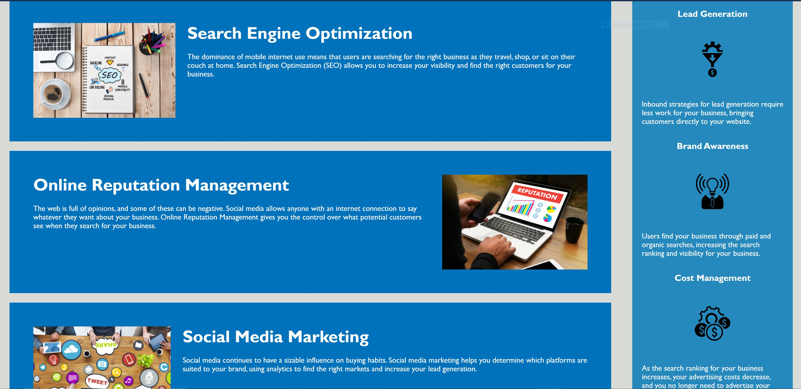

# Heroseon

## Objectives
* Webpage meets accessibility standards
* There are semantic HTML elements
* Elements follow a logical structure
* Image elements have alt attributes
* Heading attributes fall into a sequential order
* Title element is concise and descriptive

## Development Process
* Added Semantic HTML elements
* Added alt attributes to all images
* Added comments to HMTL and CSS for easy reading
* Added a descriptive title
* Fixed links in the nav and added link to title in the header

## Technology Used
* HTML 5
* CSS 3

## Access for Horiseon
https://jahilario.github.io/horiseon-project/
